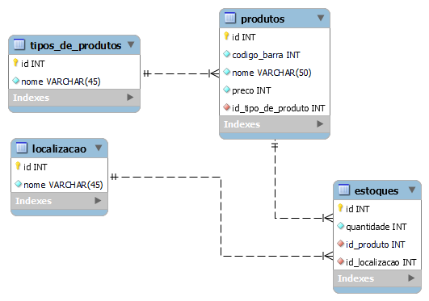

# StockDev

# Sobre o Projeto
Projeto stockDev foi criado em busca de solucionar um problema de estoque que tinha 5 localidades, projeto foi planejado para futuramente receber atualizações e funcionalidade mais robustas para uma melhor gestão no estoque, no projeto você é capaz de lançar produtos, tipos de produtos, localização, e armazernar no estoque. é capaz de visualizar, editar, exluir, fazer saida de produtos e entrada de produtos.

## Layout do projeto
.png>) .png>) .png>) .png>) .png>) .png>) .png>) .png>) .png>)
## Modelo conceitual

## Back end
- Node.JS
- Sequelize
- MySQL
- Express

## Front end (Template Engine)
- ejs
- Bootstrap

## Como executar o projeto
### `npm run start` 
Executar app no modo de desenvolvimento.
Abra [http://localhost:2000/product](http://localhost:2000/product) para visualizar em seu navegador.

você também podera ver erros pelo console.

### `npm run dev`
Executar webpack
Funcionalidade importante para transformar, agrupar e empacotar recursos.

### `Criar Tabelas de Banco de Dados`
Depois de ter criando o Banco de Dados e conectado com a aplicação 
a criação de tabelas fica simples.

Na pasta `src/models/LocationModel` e `src/models/TypeProductModel` irá descomentar a linhas 11 dos dois arquivos,
e rodar a aplicação, isso ira criar duas tabelas no banco de dados, `locations` e `type_products`, depois disso irá comentar
novamente as linhas, se não o `sync` irá continuar forçando a criação das respectivas tabelas.

Esse processo irá ser repetir nas próximas tabelas, na pasta `src/models/ProductModel` irá descomentar a linhas 27,
e rodar a aplicação, isso ira criar a tabela no banco de dados, `products`, depois disso irá comentar
novamente as linha 27.

Na pasta `src/models/StockModel` irá descomentar a linhas 21, e rodar a aplicação 
isso ira criar a tabela no banco de dados, `stocks`, depois disso irá comentar
novamente as linha 21.